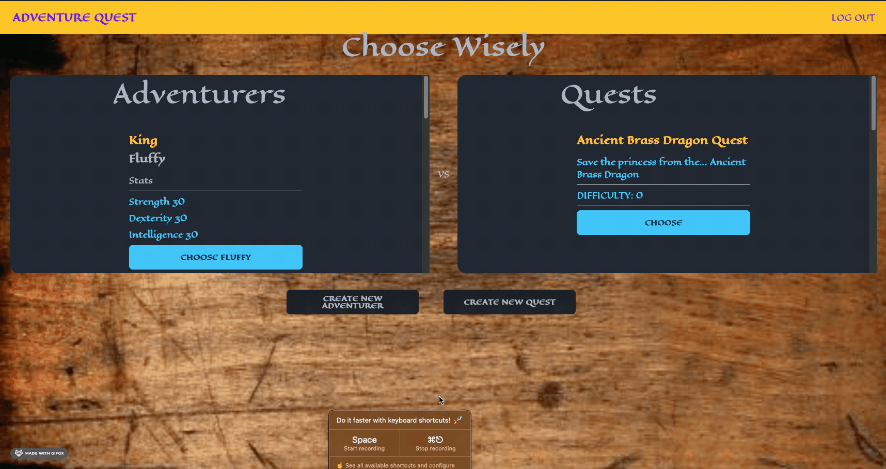

# adventureQuest

## Description

Adventure Quest is a single player high fantasy data driven user experience. Are you an Adventurer seeking a Quest?

## Link to Deployed Application

[Click to view the deployed application](https://warm-falls-71074.herokuapp.com/)



## Table of contents

- [Technologies Employed](#technologies-employed)
- [Key Functions](#key-functions)
- [License](#license)
- [Contact/Questions](#questions)
- [Summary](#summary-and-learning-points)

## Technologies Employed

| Techlogy             | Implementation/Use       |
| -------------------- | ------------------------ |
| Node.js              | JavaScript runtime       |
| Node Package Manager | Manage node packages     |
| dotenv               | Environment Variables    |
| Express.js           | Web framework            |
| sequelize            | ORM                      |
| bcrypt               | password encryption      |
| Heroku               | Deployment               |
| Handlebars           | Template and View engine |

## Key Functionality

### adventureQuest

A client side function, listening for a click event, that makes a request to the sever, which in turn queries the database.
It was particularly interesting because we used the URL to give the primary key for the "AdventureQuest" that was creted.

```javascript
adventureQuest.on("click", async () => {
  aid = await getAid();
  qid = await getQid();
  const res = await fetch(`api/adventurequest`, {
    method: "POST",
    body: JSON.stringify({ adventurerId: aid, questId: qid }),
    headers: {
      "Content-Type": "application/json",
    },
  });
  if (res.ok) {
    res.json().then((data) => {
      const aq = data.pk.id;
      document.location.replace(`gameplay/${aq}`);
    });
  }
});
```

### router.get("/questBoard")

This was a key route in our program because it gets all data for the current users adventurers, as well as all quests
made by any QuestMaster registered on AdventureQuest. It then sends all of the information to the Handlebars template.

```javascript
router.get("/questBoard", auth, async (req, res) => {
  try {
    const questData = await Quest.findAll({
      order: [["created_at", "DESC"]],
    });

    const adventurerData = await Adventurer.findAll({
      include: [{ model: Class }],
      order: [["created_at", "DESC"]],
      where: { questMasterId: req.session.questMasterId },
    });

    //serializedata
    const quests = questData.map((quest) => quest.get({ plain: true }));
    const adventurers = adventurerData.map((adventure) =>
      adventure.get({ plain: true })
    );

    res.render("questBoard", {
      quests,
      adventurers,
      logged_in: req.session.logged_in,
    });
  } catch (err) {
    console.log("Error fetching data");
  }
});
```

## License

This software is licensed under the MIT [LICENSE](./LICENSE)

## Questions?

Please visit our gitHubs

[Sid (sharkby7e)](https://www.github.com/sharkby7e)
[Krystopher (KrystopherQ)](https://github.com/KrystopherQ)
[Click to view the deployed application](https://github.com/Blec333)

## Summary and Learning Points

###Sid
This was an extremely fun application to build. Not only because of my team, but because we got to be creative. We had to find
solutions to "problems" that we "created" ourselves, and I really enjoyed the process. I enjoyed working in a group, and definitely
learned a lot about how I personally deal with teamwork.
